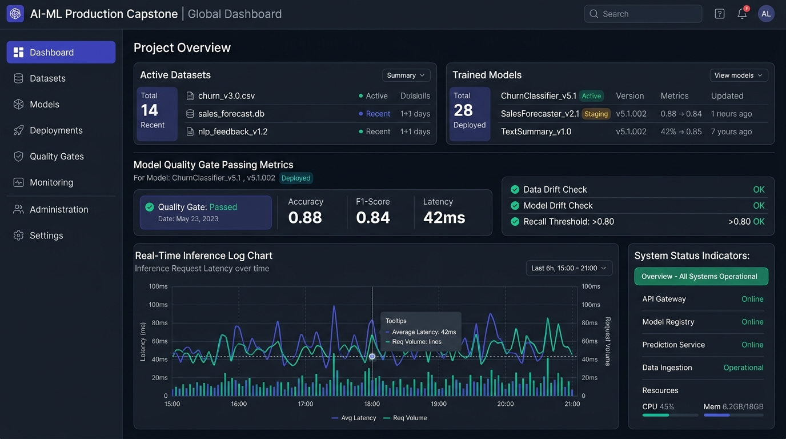
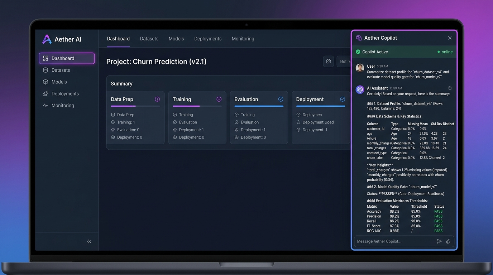

# AuraML — AI/ML Production Capstone

## Enterprise MLOps, AI Copilot & Model Governance Platform

AuraML is a production-grade machine learning and data operations platform. It unifies the end-to-end ML lifecycle into a single application — from dataset ingestion, data profiling, and automated training to quality gate evaluation, model promotion governance, real-time inference serving, and natural language AI Copilot orchestration.

---

## 🌐 Live Production Deployments

- **Frontend Application (Vercel)**: [https://ai-ml-production-capstone.vercel.app](https://ai-ml-production-capstone.vercel.app)
- **Backend API Docs (Render)**: [https://capstone-demo-api.onrender.com/docs](https://capstone-demo-api.onrender.com/docs)
- **Technical Interview & Architecture Guide**: [interview.md](interview.md)

---

## 📸 Platform Screenshots

### 1. MLOps Global Dashboard & Inference Monitoring


### 2. AI Copilot Assistant & Model Quality Gate Verification


---

## 🏗 System Architecture

```text
                     ┌────────────────────────┐
                     │     User / Browser     │
                     └───────────┬────────────┘
                                 │
                                 │ HTTP / REST
                                 ▼
                     ┌────────────────────────┐
                     │ React Frontend (Vercel)│
                     └───────────┬────────────┘
                                 │
                                 │ REST API
                                 ▼
                     ┌────────────────────────┐
                     │  FastAPI Backend (Render)
                     │ - RBAC Security        │
                     │ - AI Assistant Engine  │
                     └───────┬────────┬───────┘
                             │        │
                      Dataset│        │Job Queue
                             │        │
                             ▼        ▼
                   ┌────────────┐  ┌────────────┐
                   │  Storage   │  │ SQL Job    │
                   │ (S3/Local) │  │ Queue      │
                   └─────┬──────┘  └─────┬──────┘
                         │                │
                         │                │ Job Execution
                         │                ▼
                         │       ┌────────────────┐
                         └──────►│ Python Worker  │
                                 │ Background ML  │
                                 └───────┬────────┘
                                         │
                               ┌─────────┴─────────┐
                               │                   │
                               ▼                   ▼
                        ┌────────────┐      ┌─────────────┐
                        │ PostgreSQL │      │ Scikit-learn│
                        │ Database   │      │ ML Training │
                        └────────────┘      └──────┬──────┘
                                                   │
                                                   ▼
                                            ┌─────────────┐
                                            │    Model    │
                                            │   Artifact  │
                                            └──────┬──────┘
                                                   │
                                                   ▼
                                          ┌────────────────┐
                                          │ Prediction API │
                                          └───────┬────────┘
                                                  │
                                                  ▼
                                          ┌────────────────┐
                                          │ Real-Time      │
                                          │ Inference Log  │
                                          └────────────────┘
```

---

## 🚀 Key Features

### 1. Dataset Management & Data Profiling
- Asynchronous CSV dataset upload and validation.
- Schema inference, column statistical distributions, and missing-value analysis.
- Multi-tenant workspace storage isolation.

### 2. Automated Model Training & Registry
- Asynchronous background training worker powered by Scikit-learn.
- Strict model state machine (`draft` → `candidate` → `approved` / `rejected` → `staging` / `production`).
- Artifact storage and hyperparameter tracking.

### 3. Automated Quality Gate Policy
- Enforces production readiness before models can serve real-time predictions:
  - **Accuracy $\ge 0.85$**
  - **F1 Score $\ge 0.80$**
  - **Latency $\le 100\text{ ms}$**
- Models failing the quality gate are automatically marked `rejected` and blocked from real-time endpoints.

### 4. AI Copilot Assistant Orchestrator
- Natural language query orchestration (`/api/v1/agent/orchestrate`).
- Integrated dataset profiler tool, quality gate evaluation, and task management.
- Non-blocking markdown fallback response formatting.

### 5. Multi-Tenant RBAC Security & Audit Logging
- Role-Based Access Control (`owner`, `editor`, `viewer`).
- Transactional Outbox pattern for decoupled event publishing.
- Immutable audit event logging for all compliance and write operations.

---

## 🛠 Technology Stack

| Layer | Technology | Purpose |
| :--- | :--- | :--- |
| **Frontend** | React 18, TypeScript, Vite, Tailwind CSS | Web application SPA hosted on Vercel |
| **Backend API** | Python 3.11, FastAPI, Pydantic v2 | REST API & AI Orchestrator hosted on Render |
| **Database** | PostgreSQL, SQLAlchemy 2.0 (AsyncIO), Alembic | Relational database & ORM persistence |
| **Worker Queue** | Async SQL Engine with Savepoint Isolation | Background dataset profiling & model training |
| **ML Engine** | Scikit-learn, Pandas, NumPy, Joblib | Model training, quality evaluation & inference |
| **Testing & Quality** | Pytest, Pytest-Asyncio, Ruff | Linter, code formatting & unit test suite |

---

## 📊 Example: Customer Churn Prediction

AuraML includes a complete binary classification workflow:

```text
Customer Features (Tenure, Contract, Monthly Charges)
        ↓
    ML Model
        ↓
   Churn Prediction
        ↓
   ┌───────────────┐
   │ 0 → Stayed    │
   │ 1 → Churned   │
   └───────────────┘
```

---

## 💻 Quickstart (Local Development)

### Prerequisites
- Python 3.11+
- Node.js 20+
- npm

### 1. Clone the Repository
```bash
git clone https://github.com/varunsharma0111/AI-ML-Production-Capstone.git
cd AI-ML-Production-Capstone
```

### 2. Install Backend & Frontend Dependencies
```bash
pip install -e .[dev]
cd apps/web && npm install && cd ../..
```

### 3. Run Automated Tests & Quality Checks
```bash
python -m ruff check .
python -m pytest tests/unit/
```

### 4. Start Local API & Frontend
```bash
# Terminal 1 - API Backend
uvicorn apps.api.app.main:app --reload --port 8000

# Terminal 2 - React Frontend
cd apps/web && npm run dev
```

---

## 📄 Documentation Links

- 📚 [Interview & Technical Architecture Guide](interview.md) — Comprehensive guide covering DB schemas, design patterns, MLOps state transitions, and interview Q&A.
- 📐 [Architecture Overview](docs/architecture.md) — Module hierarchy and component interaction patterns.
- 🔐 [Security & RBAC Guide](docs/security.md) — Authentication, permissions, and policy enforcement.
- 🔌 [API Documentation](docs/api.md) — Complete REST API specification.
